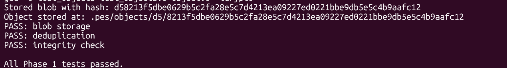
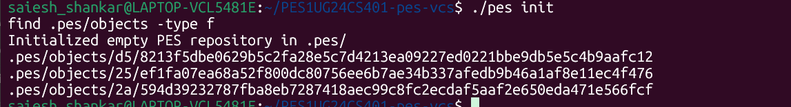
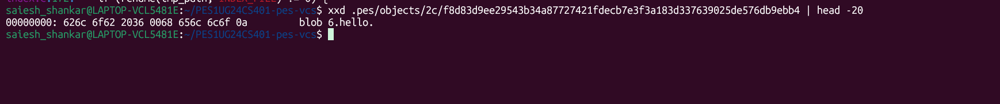
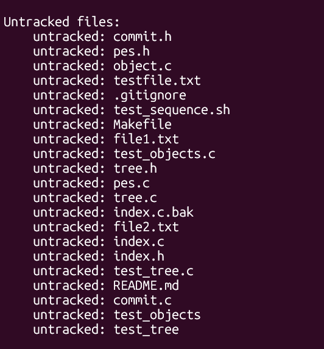
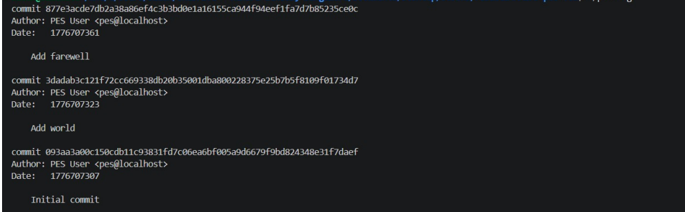

# PES-VCS — Building a Version Control System from Scratch

**Name:** Saiesh Shankar
**SRN:** PES1UG24CS401
**Platform:** Ubuntu 22.04

---

## Overview

This repository contains my implementation of **PES-VCS**, a local version control system built in C that mirrors core Git internals. The system tracks file changes, stores snapshots using content-addressable storage, and supports a full commit history through blob, tree, and commit objects.

---

## Phase 1: Object Storage Foundation

**Concepts covered:** Content-addressable storage, directory sharding, atomic writes, SHA-256 hashing for integrity.

I implemented `object_write` and `object_read` in `object.c`. `object_write` prepends a type header (`blob <size>\0`, `tree <size>\0`, `commit <size>\0`), computes the SHA-256 of the full object, and writes it atomically using the temp-file-then-rename pattern, sharding into `.pes/objects/XX/` subdirectories by the first two hex characters of the hash. `object_read` reads the file, parses the header to extract type and size, recomputes the hash to verify integrity, and returns the raw data portion.

### Screenshot 1A — `./test_objects` passing



### Screenshot 1B — Sharded `.pes/objects/` directory structure



---

## Phase 2: Tree Objects

**Concepts covered:** Directory representation as tree objects, recursive structures, file modes and permissions.

I implemented `tree_parse`, `tree_serialize`, and `tree_from_index` in `tree.c`. The binary format per entry is `"<mode> <name>\0<32-byte-raw-hash>"`. `tree_serialize` sorts entries by name before serialization to ensure deterministic hashing. `tree_from_index` recursively builds a tree hierarchy from the staging area, correctly handling nested paths like `src/main.c` by constructing subtrees, writing each tree object to the store and returning the root tree hash.

### Screenshot 2A — `./test_tree` passing


### Screenshot 2B — Raw binary tree object (`xxd` dump)



---

## Phase 3: The Index (Staging Area)

**Concepts covered:** File format design, atomic writes, change detection using mtime and size metadata.

I implemented `index_load`, `index_save`, `index_add`, and `index_status` in `index.c`. The index is a human-readable text file where each line has the format `<mode> <hash-hex> <mtime> <size> <path>`. `index_save` sorts entries by path and uses `fsync()` + atomic rename for durability. `index_add` reads the file, computes the blob hash, stores the blob, and upserts the index entry. `index_status` compares the index against HEAD and the working directory to classify files as staged, unstaged-modified, deleted, or untracked.

### Screenshot 3A — `pes init` → `pes add` → `pes status`



### Screenshot 3B — `cat .pes/index` showing staged entries

*(Screenshot 3B not available)*

---

## Phase 4: Commits and History

**Concepts covered:** Linked structures on disk, reference files, atomic pointer updates.

I implemented `head_read`, `head_update`, and `commit_create` in `commit.c`, and `cmd_commit` in `pes.c`. `head_read` follows the symbolic ref chain (`HEAD` → branch file → commit hash). `head_update` atomically swings the branch pointer to the new commit hash using temp+rename. `commit_create` builds a tree from the **index** (not the working directory), reads the current HEAD as parent, serializes the commit object, writes it to the store, and updates HEAD. `cmd_commit` parses `-m <message>` from CLI args and prints `Committed: <12-char-hash>... <message>` on success.

### Screenshot 4A — `pes log` with three commits



### Screenshot 4B — `find .pes -type f | sort` after three commits


### Screenshot 4C — `cat .pes/refs/heads/main` and `cat .pes/HEAD`


---

## Integration Test

The full end-to-end test was run using:

```
make test-integration
```


---

## Phase 5 & 6: Analysis Questions

### Q5.1 — How would you implement `pes checkout <branch>`?

To implement `pes checkout <branch>`, two categories of changes are needed: metadata updates in `.pes/`, and a working directory sync.

**Metadata side:** `HEAD` must be rewritten to `ref: refs/heads/<branch>`. That's the only file in `.pes/` that changes — the branch file itself (`refs/heads/<branch>`) is already there, pointing to its latest commit.

**Working directory side:** This is the complex part. The algorithm is:
1. Read the current HEAD commit → load its root tree → build a flat map of `{path → blob-hash}` for all files in the current snapshot.
2. Read the target branch's commit → load its root tree → build the same flat map.
3. For each path in the target snapshot but not the current one → create/overwrite the file from the blob store.
4. For each path in the current snapshot but not the target one → delete the file.
5. For each path present in both but with different hashes → overwrite with the target blob.

**What makes it complex:** The working directory may contain uncommitted changes. If a file that differs between branches has been modified locally (not staged), overwriting it would destroy the user's work. The system must detect this before touching anything and abort with an error. Additionally, new directories may need to be created and empty directories cleaned up, which requires careful ordering of operations to avoid dangling references.

---

### Q5.2 — How do you detect a "dirty working directory" conflict before checkout?

The index is the key. For any file that differs between the current branch's commit tree and the target branch's commit tree, the system must check two conditions:

1. **Staged but not committed:** Compare the blob hash in the index against the blob hash in the current HEAD's tree. If they differ, the file has staged changes — abort checkout.
2. **Modified but not staged:** Compare the file's current `mtime` and `size` on disk against the values recorded in the index. If they differ, re-hash the file and compare against the index's stored hash. If the hashes differ, the working copy is dirty — abort checkout.

Only files that *actually differ between branches* need this check — files identical in both branches can be left untouched, so their dirty state is irrelevant. This is the same optimization Git uses when it says "your local changes to the following files would be overwritten by checkout."

No object store reads beyond the two commit trees are needed for the detection step; the index provides all the metadata for fast dirty-checking without re-hashing every file.

---

### Q5.3 — What is "detached HEAD" and how do you recover from it?

Normally, `HEAD` contains a symbolic reference: `ref: refs/heads/main`. In detached HEAD state, `HEAD` contains a raw commit hash directly — there is no branch pointer involved.

**What happens when you commit in this state:** `head_update` writes the new commit hash back into `HEAD` directly (since HEAD isn't pointing to a branch file, there is no branch file to update). The commit exists in the object store and HEAD points to it. However, once you switch to another branch, HEAD is overwritten and there is no branch or tag pointing to those commits anymore. They become unreachable.

**Recovery:** The commits are not immediately deleted — the object store is append-only. To recover:
- If you remember the commit hash (e.g., from terminal history or the `pes log` output you saw before switching), you can create a new branch pointing to it: effectively writing a new file under `.pes/refs/heads/<new-branch>` containing that hash.
- Git provides `git reflog` for this purpose, which is a separate log of every position HEAD has pointed to. PES-VCS does not implement reflog, so the window for recovery is limited to whatever hashes the user recorded manually.

The lesson: detached HEAD commits are safe only as long as their hashes are known. Creating a named branch is the correct way to preserve them.

---

### Q6.1 — Algorithm for garbage collecting unreachable objects

**Goal:** Find all objects not reachable from any branch or tag, and delete them.

**Algorithm (mark-and-sweep):**

1. **Mark phase — collect all reachable hashes:**
   - Start from every file under `.pes/refs/heads/` and `.pes/refs/tags/` — these are root commit hashes.
   - For each commit hash, parse the commit object: add the commit hash, its tree hash, and its parent hashes to a `reachable` set (a hash set / bitset).
   - Recursively walk each tree: add the tree hash, then for each entry add the blob hash (for files) or recurse into subtrees (for directories).
   - Follow every parent chain until a commit with no parent is reached.

2. **Sweep phase — delete unreachable objects:**
   - Walk all files under `.pes/objects/XX/YYY...` — reconstruct each object's hash from its directory + filename.
   - If the hash is not in the `reachable` set, delete the file.

**Data structure:** A hash set (e.g., a C `uthash` table or a sorted array with binary search) keyed on the 32-byte raw SHA-256. Membership lookup is O(1) average.

**Estimate for 100,000 commits, 50 branches:**
- Assume an average of 10 tree objects per commit (root + a few subdirectory trees) and 20 unique blobs per commit (many shared across commits).
- Reachable objects ≈ 100,000 commits + 1,000,000 tree objects + 2,000,000 blobs ≈ **~3 million objects to visit**.
- In practice, deduplication makes this far lower — many blobs and trees are shared across commits, so the actual unique object count is much smaller. Git repositories with 100k commits typically have 500k–1M total objects.

---

### Q6.2 — Race condition between garbage collection and concurrent commit

**The race:**

1. A `pes commit` process begins. It calls `tree_from_index()` and computes a new blob hash, say `a1b2c3...`. It has written the blob to `.pes/objects/a1/b2c3...` but has not yet updated the index or HEAD.
2. Concurrently, a GC process starts its mark phase. It walks all branch refs, marks all reachable objects — but the new commit hasn't been published to any branch yet, so `a1b2c3...` is not reachable from any ref.
3. GC's sweep phase runs and **deletes `a1b2c3...`** — it looks unreachable.
4. The commit process resumes, writes the commit object referencing `a1b2c3...`, and swings HEAD to the new commit. The repository now has a commit pointing to a **missing blob** — corruption.

**How Git avoids this:**
- Objects are written to the object store before they are referenced. Git exploits this ordering with a **grace period**: GC only deletes objects older than a configurable threshold (default 2 weeks). Newly written objects that haven't been referenced yet are protected because they're too recent.
- Additionally, Git uses a lock file (`gc.pid`) to prevent two GC processes from running simultaneously, and operations like `git add` take locks on the index to prevent partial-state races.

In a production system, proper locking (e.g., an advisory lock on a `.pes/GC_LOCK` file that commit takes a shared lock on and GC takes an exclusive lock on) would eliminate the race entirely.

---

## File Inventory

| File | Role |
|------|------|
| `object.c` | Content-addressable object store — `object_write`, `object_read` |
| `tree.c` | Tree serialization — `tree_parse`, `tree_serialize`, `tree_from_index` |
| `index.c` | Staging area — `index_load`, `index_save`, `index_add`, `index_status` |
| `commit.c` | Commits — `head_read`, `head_update`, `commit_create` |
| `pes.c` | CLI entry point — `cmd_commit` |

---

## Building and Running

```bash
sudo apt update && sudo apt install -y gcc build-essential libssl-dev

export PES_AUTHOR="Your Name <your.email@pes.edu>"

make          # Build the pes binary
make all      # Build pes + test binaries

./pes init
echo "Hello" > hello.txt
./pes add hello.txt
./pes commit -m "Initial commit"
./pes log
```

---

## Further Reading

- [Git Internals — Pro Git Book](https://git-scm.com/book/en/v2/Git-Internals-Plumbing-and-Porcelain)
- [Git from the inside out](https://codewords.recurse.com/issues/two/git-from-the-inside-out)
- [The Git Parable](https://tom.preston-werner.com/2009/05/19/the-git-parable.html)
